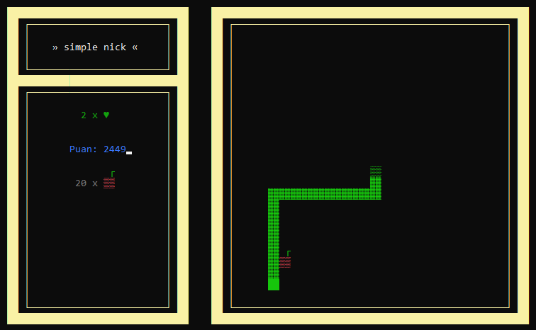
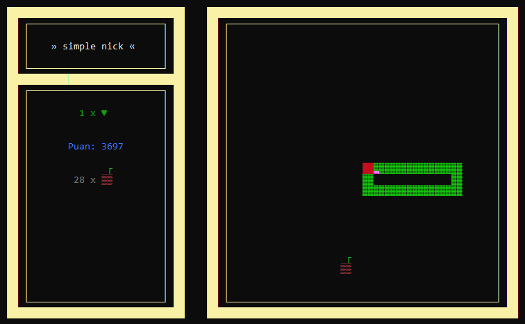
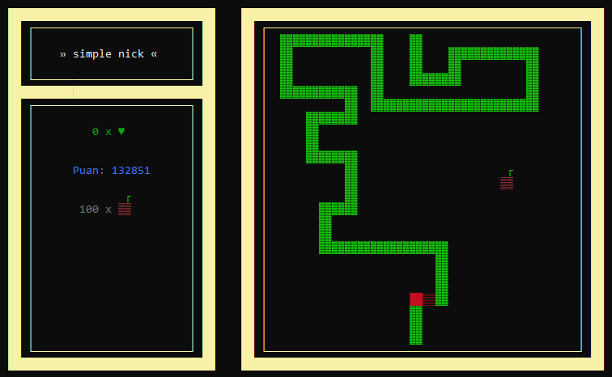

### A snake game played on the command screen!

A simple console application I made to warm up to the C programming language after a long time. It's been a nice game to remember linked list, macros, pointers and keyboard usage. However, it has some issues. For example, there is no text or screen indicating that the game has started or ended.

**Inputs from the player**
- Nick
- Gameboard width & height
- Game speed [50ms - 200ms]
- Number of apples [1 - 10]

**Some Features**
- Playing with arrow keys
- You have 3 lives
- You earn 1 point when move and 100 points when ate apple
- When you bite yourself, you lose the part from the bite to the tail

**Screenshots**








**Some Presets**
```C
// MAX MIN AND OTHER VALUES
#define MIN_NAME_LENGTH 4
#define MAX_NAME_LENGTH 12
#define MIN_BOARD_SIZE 15
#define MAX_BOARD_SIZE 30
#define MAX_APPLE_DENSITY 10
#define SCORE_ON_MOVE 1
#define SCORE_ON_APPLE 100

// TEXT AND QUESTIONS
#define SCORE_T "Puan: %d"
#define NICK_Q "Oyuncu ismi [%d-%d]: "
#define BOARDWIDTH_Q "Tahta genisligi [%d-%d]: "
#define BOARDHEIGHT_Q "Tahta yuksekligi [%d-%d]: "
#define SLOW_V "1: Yavas [200ms]\n"
#define MID_V "2: Orta [150ms]\n"
#define FAST_V "3: Hizli [100ms]\n"
#define VERYFAST_V "4: Cok Hizli [50ms]\n"
#define SPEED_Q "Oyun hizi: "
#define APPLE_Q "Elma sayisi [1-%d]: "

// COLORS
#define FRAME_C 14
#define APPLE_C 12
#define SNAKE_C 10
```
